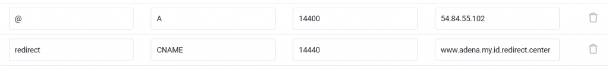
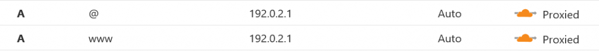
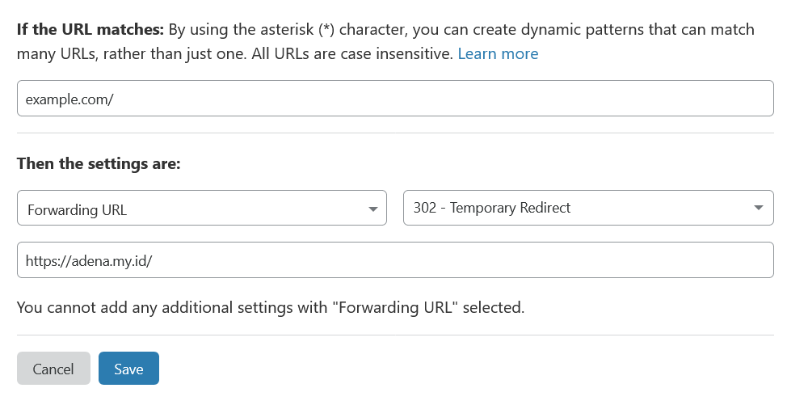

Ketika ingin melakukan redirect dari satu domain ke domain lainnya, biasanya langkah pertama yang terlintas adalah menggunakan fungsi redirect di web hosting. Namun, bagaimana jika Anda tidak memiliki web hosting dan hanya bisa mengakses DNS?

## Menggunakan redirect.center

### Tambahkan Record DNS

1.  Tambahkan A record dengan nama `@` dan value `54.84.55.102`.
2.  Tambahkan juga CNAME record dengan nama `redirect` dan value `tujuan.com.redirect.center`.

Ganti `tujuan` menjadi alamat website anda

Sekarang Anda bisa dengan mudah mengarahkan dari path ke domain lain atau dari subdomain ke domain lain. Untuk informasi lebih lanjut, kunjungi [redirect.center](http://redirect.center/).

## Menggunakan Cloudflare

### Langkah 1: Tambahkan Record DNS dan Aktifkan Fitur Proxy

1.  Tambahkan A record dengan nama `@`, `www`, dan subdomain lain yang ingin Anda alihkan.
2.  Aktifkan fitur proxy Cloudflare dan isi value dengan `192.0.2.1`.

### Langkah 2: Tambahkan Page Rule

Pada bagian "If the URL matches:", dalam contoh ini, pola yang digunakan adalah "example.com/", yang berarti semua URL yang dimulai dengan "example.com/" akan diarahkan.

Kemudian pada bagian "Then the settings are:", Anda dapat memilih tindakan yang akan dilakukan ketika URL cocok dengan pola.

Dalam contoh ini, pengaturannya adalah:

1.  "Forwarding URL" - URL tujuan yang akan diarahkan.
2.  "302 - Temporary Redirect" - Jenis redirect yang dilakukan, yaitu redirect sementara (kode status HTTP 302).

Dengan pengaturan ini, setiap kali ada permintaan ke URL yang dimulai dengan "example.com/", permintaan tersebut akan diarahkan ke forwarding URL.

Simpan perubahan dan coba akses website Anda. Dengan mengikuti langkah-langkah di atas, seharusnya Anda akan langsung diarahkan ke domain tujuan.

Itulah cara praktis untuk melakukan redirect antar domain hanya dengan menggunakan DNS. Jika ada pertanyaan, jangan ragu untuk meninggalkan komentar. Terima kasih!